# 🏗️ Portfolio Bot — System Architecture

> A production-grade, **Agentic Hybrid RAG** personal assistant engineered for speed, safety, and deep observability. Every design decision was made with production constraints in mind — free-tier limits, zero-disk deployments, and recruiter-grade transparency.

---

## 📐 System Overview

The full system is composed of 8 distinct layers. The diagram below shows how they connect:

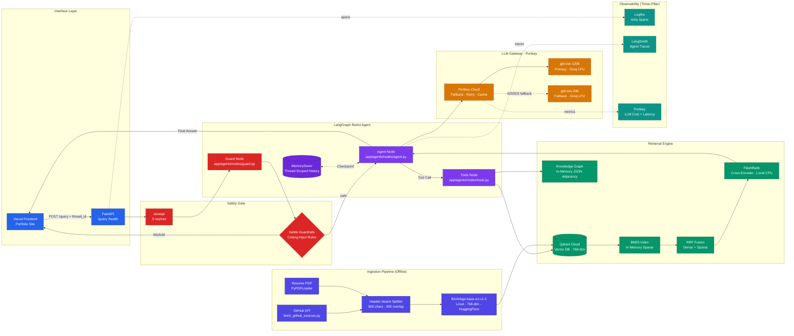

---

## 1. Ingestion Pipeline

The ingestion pipeline is a **one-time, offline process** that converts raw documents into a queryable knowledge base. It is idempotent — safe to re-run with content-hash deduplication.

### 1.1 Source Acquisition

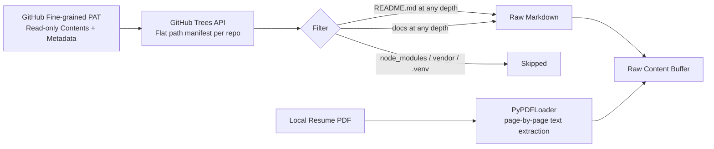

- Pulls from **public and private repositories** using a fine-grained PAT.
- **Git blob SHA manifest** prevents re-fetching unchanged files on incremental runs.
- Filter matches `README.md` and `docs/*.md` at **any nesting depth**.

### 1.2 Chunking

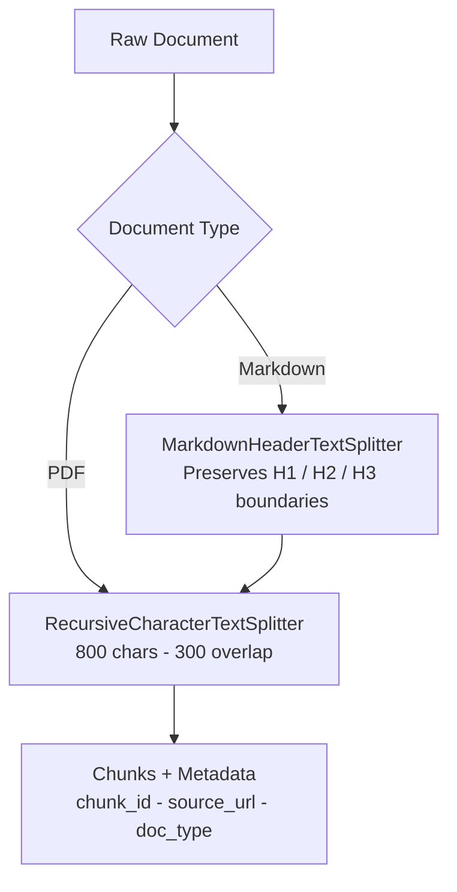

| Parameter | Value | Rationale |
|-----------|-------|-----------|
| Chunk size | 800 chars | Fits inside the 2048-token embedding input limit |
| Overlap | 300 chars | Preserves context across chunk boundaries |
| Markdown mode | Header-aware | Keeps section titles with their content |
| PDF mode | Recursive | Handles free-form resume prose |

### 1.3 Embedding and Storage

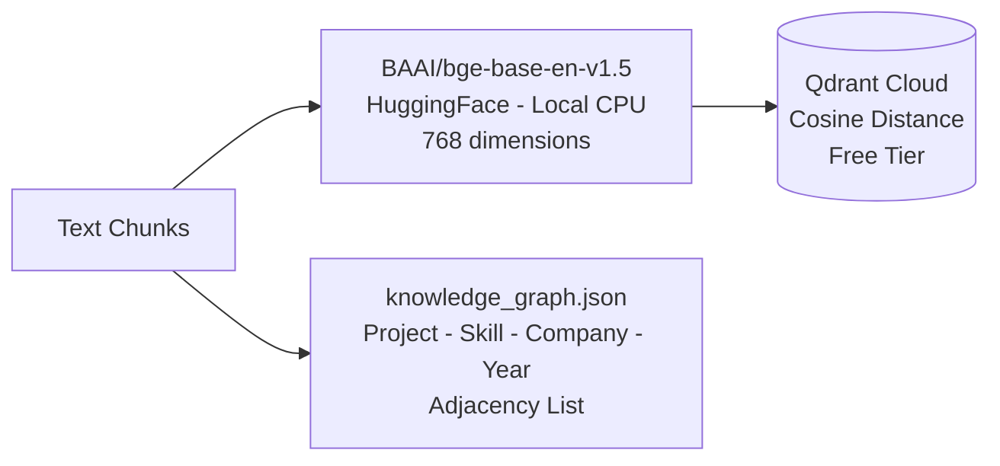

**Why local BGE instead of a cloud embedding API?**

| | Cloud Embeddings (Gemini) | Local BGE |
|--|--|--|
| Free rate limit | 100 RPM — 429s on batch | Unlimited |
| Network latency | Round-trip per batch | None — in-process |
| Consistency | Risk if model version changes | Pinned, stable |
| Batch ingest risk | High — 898 chunks | Zero |

---

## 2. Retrieval Engine

Every tool call triggers a **3-stage hybrid retrieval pipeline**.

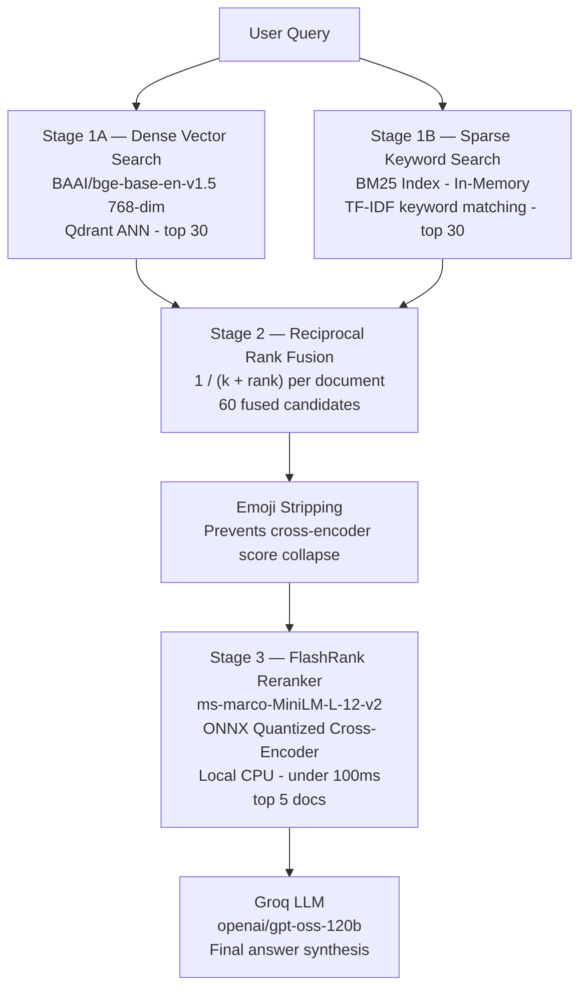

| Stage | Method | Strength | Weakness |
|-------|--------|----------|---------|
| Dense (Qdrant) | ANN on 768-dim vectors | Finds semantically similar content | Misses exact keyword matches |
| Sparse (BM25) | TF-IDF keyword frequency | Exact match for names, titles | No semantic understanding |
| RRF | Rank fusion | Best of both worlds | Returns 60 candidates — still too many |
| FlashRank | Cross-encoder reranking | Deeply accurate relevance scoring | Only feasible on small candidate set |

---

## 3. Knowledge Graph

The Knowledge Graph answers **relational queries** that semantic similarity alone cannot satisfy — e.g., *"What tech stacks did you use in 2024?"*

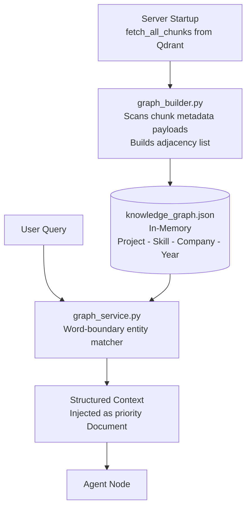

**Key design:** The graph is built entirely from **Qdrant metadata payloads** at startup. No Neo4j, no extra credentials. The deployment stays stateless and single-service.

---

## 4. LangGraph ReAct Agent

### 4.1 Why ReAct Instead of a Pipeline?

The original pipeline (`Planner -> Retriever -> Responder`) caused **Context Amnesia**: on follow-up questions, the Planner generates a new search query and overwrites previous context.

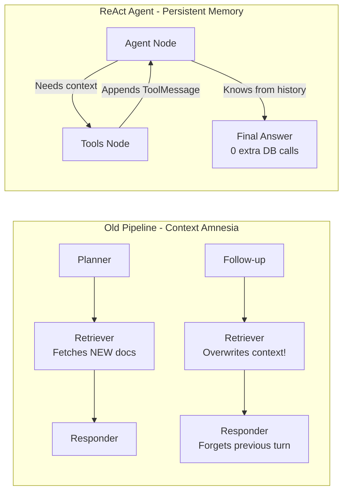

### 4.2 The Execution Loop

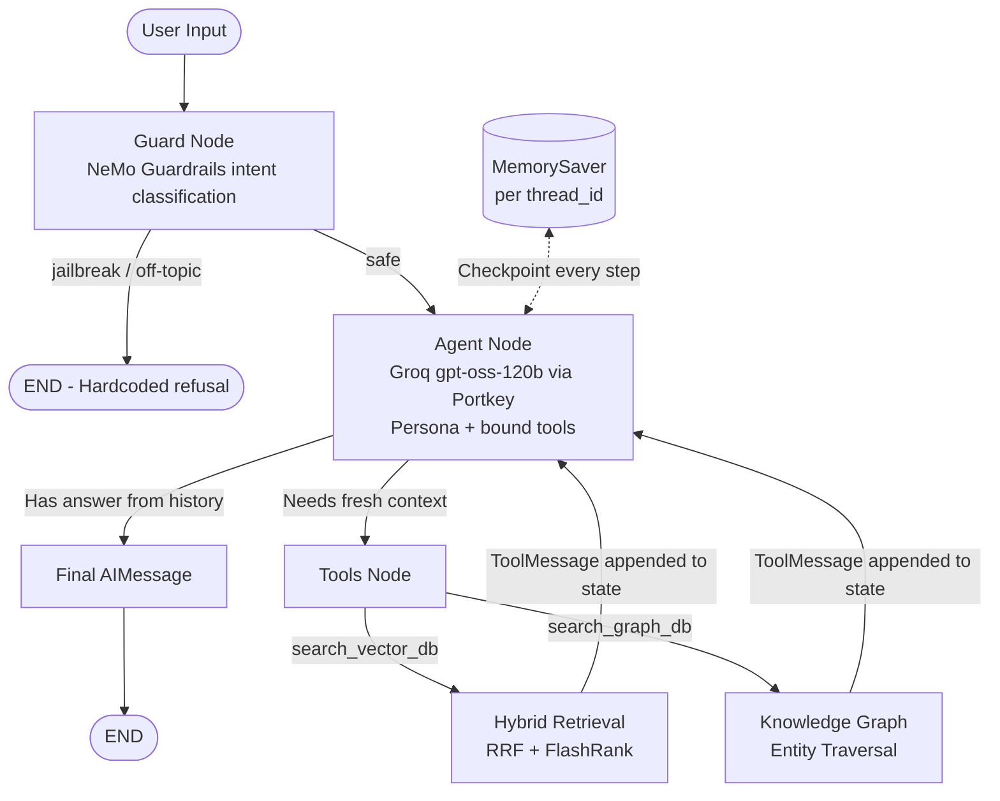

### 4.3 State Schema

```python
class AgentState(TypedDict):
    messages: Annotated[Sequence[BaseMessage], add_messages]
    rail_fired: bool
```

The `add_messages` reducer **appends** — never replaces. Every `ToolMessage` result is inserted directly into the shared state, giving the LLM full recall of every search it has performed.

---

## 5. Safety Layer (NeMo Guardrails)

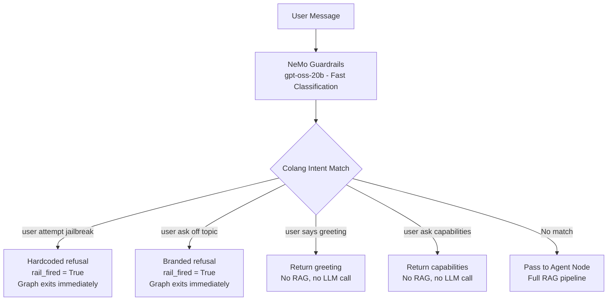

**Why gpt-oss-20b for the guard?** The guard runs on every request. Its task — intent classification — is semantically simple. The 20B model is fast enough and accurate enough, without the latency overhead of the 120B model.

| Threat | Layer | Mitigation |
|--------|-------|-----------|
| Prompt injection | Guard Node | Colang jailbreak flow with semantic matching |
| Off-topic abuse | Guard Node | Branded refusal — no tokens wasted |
| Resource exhaustion | API middleware | slowapi — 5 requests per minute per IP |
| Cross-origin attacks | API middleware | CORS allow-list: 3 known frontend origins |
| PII in traces | Observability | LangSmith — fully auditable |
| Output hallucination | RAG grounding | Strict context-only prompting |

---

## 6. LLM Gateway (Portkey)

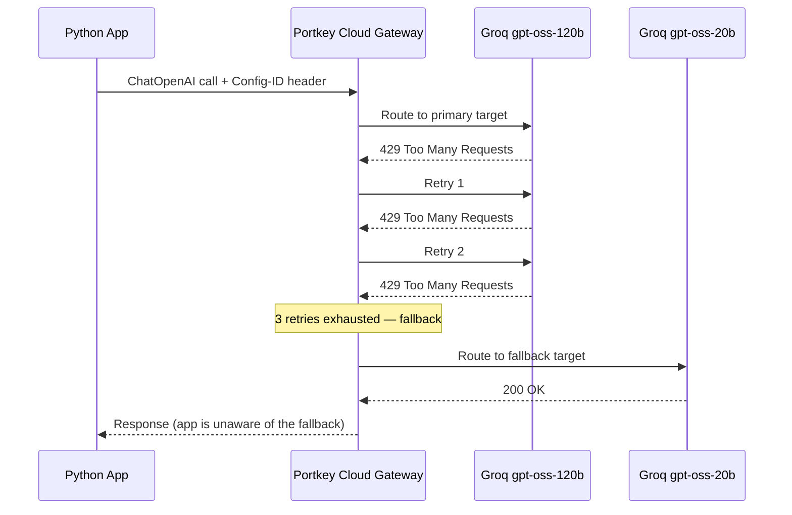

**Why ChatOpenAI not ChatGroq?** `ChatGroq` is hardwired to `api.groq.com`. `ChatOpenAI` accepts a custom `base_url`, making it the standard way to inject any proxy layer without writing a custom LangChain client.

---

## 7. Observability — Three-Pillar Stack

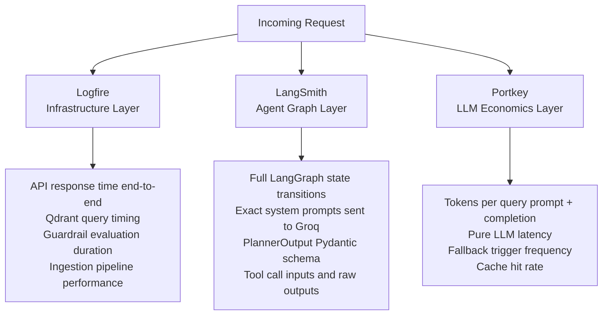

All three share the same `thread_id`. A single ID lets you trace: Logfire API span → LangSmith graph trace → exact Portkey LLM call.

---

## 8. Evaluation Suite

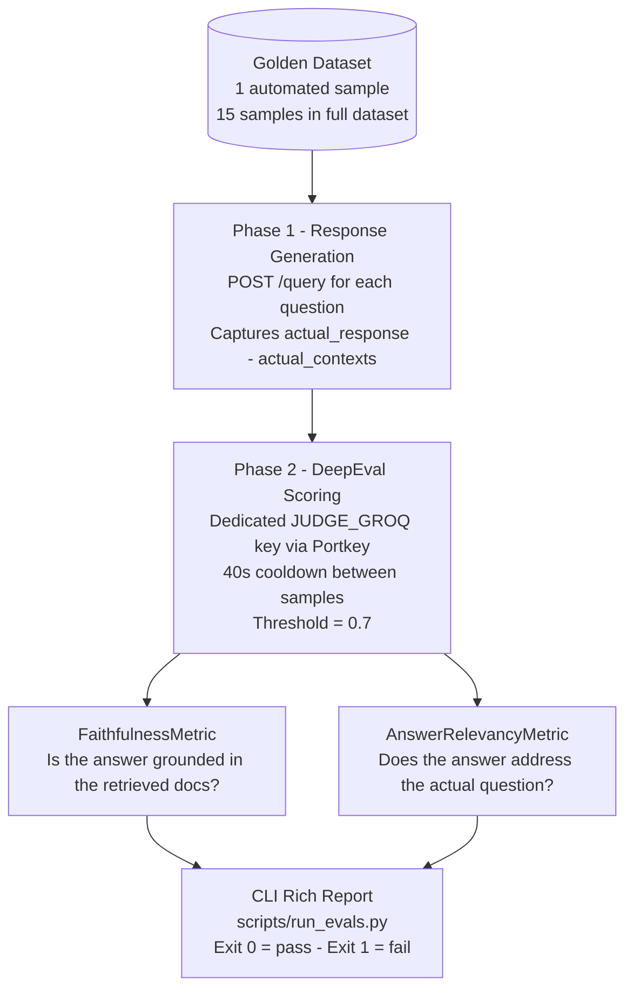

> **Dataset note:** Limited to 1 sample for CI runs to avoid Groq 429 on the Judge key (6,000 TPM free tier). Full 15-question dataset preserved in `golden_dataset_full.json`.

---

## 9. Design Decisions Table

| Decision | Chosen Approach | Why | Trade-off |
|----------|----------------|-----|-----------|
| Embeddings | Local BAAI/bge-base-en-v1.5 | Zero API calls, no 429 risk, pinned version | 768-dim vs 3072-dim cloud — sufficient for this domain |
| Agent pattern | ReAct loop | Natively solves Context Amnesia on follow-ups | More complex state management |
| LLM routing | Portkey cloud gateway | Hot-swap providers without redeploy | Adds Portkey as external dependency |
| Retrieval | RRF fusion Qdrant + BM25 | Consistently beats either retriever alone | BM25 rebuilt in-memory at every startup |
| Reranking | FlashRank local CPU ONNX | Zero latency, zero cost, no external API | Quantized model adds 30-50 MB to bundle |
| Guardrails | Input-only NeMo | Protects at gate, avoids double LLM call | No output-side PII redaction |
| Auth | CORS allow-list only | API key in browser JS is always visible | Acceptable for read-only public portfolio bot |
| Graph storage | In-memory JSON adjacency | Zero extra DB, stateless deploy | Not suitable for millions of nodes |
| Memory | MemorySaver per thread_id | Multi-turn conversations, zero extra infrastructure | In-memory only — resets on server restart |
| Free vs paid | 100% free-tier stack | Production thinking within real constraints | Rate limits require pacing in eval suite |

---

## 📚 Deep Dive References

| Layer | Document |
|-------|---------|
| Ingestion | [02 — Ingestion Engine](docs/02_INGESTION_ENGINE.md) |
| Node Architecture | [03 — Node Intelligence](docs/03_NODE_INTELLIGENCE.md) |
| Observability | [04 — Tracing and Observability](docs/04_TRACING_AND_OBSERVABILITY.md) |
| Environment Setup | [05 — Environment Variables](docs/05_ENVIRONMENT_VARIABLES.md) |
| Reranking | [07 — FlashRank Reranking](docs/07_FLASHRANK_RERANKING.md) |
| Guardrails | [08 — NeMo Guardrails](docs/08_GUARDRAILS.md) |
| LLM Gateway | [09 — LLM Gateway](docs/09_LLM_GATEWAY.md) |
| ReAct Agent | [10 — Agent Architecture](docs/10_AGENT.md) |
| Threat Model | [Threat Model](docs/threat-model.md) |
| Eval Theory | [11 — Evals](docs/11_EVALS.md) |
| Eval Pipeline | [12 — Evals Pipeline](docs/12_EVALS_PIPELINE.md) |
| Build Log | [PLAN.md](docs/PLAN.md) |