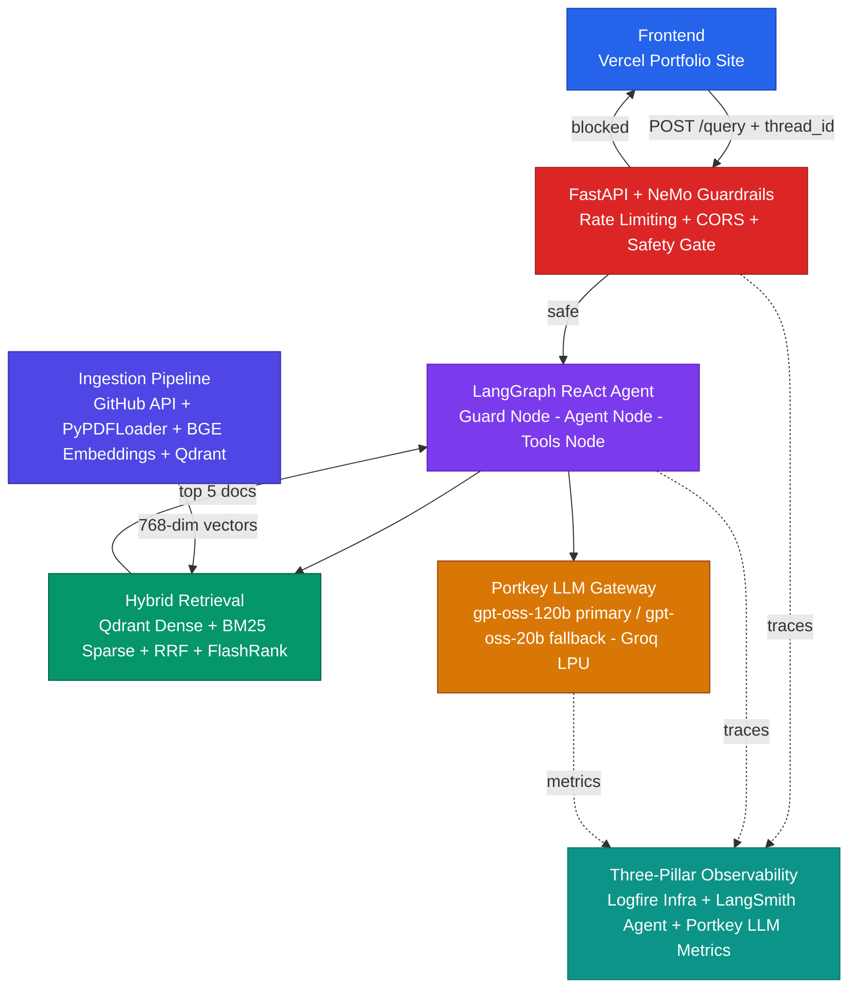

<div align="center">

# 🤖 Portfolio AI Assistant

**A production-grade Agentic RAG chatbot that answers questions about Muhammad Umer Khan's skills, projects, and experience.**

Built with a ReAct LangGraph agent, hybrid vector + keyword retrieval, NeMo Guardrails safety layer, and a three-pillar observability stack — running entirely on a free-tier infrastructure.

[](https://python.org)
[](https://github.com/langchain-ai/langgraph)
[](https://fastapi.tiangolo.com)
[](https://qdrant.tech)
[](https://portkey.ai)
[](https://groq.com)
[](LICENSE)

</div>

---

## 🎯 What Is This?

Recruiters and hiring managers typically spend under 60 seconds reviewing a portfolio. This bot lets them **ask anything** — in plain English — and get instant, accurate, grounded answers from Umer's real resume, GitHub projects, and technical documentation.

It is not a chatbot wrapper over ChatGPT. It is a **fully engineered RAG system** with:
- An agentic loop that decides dynamically when to search, what tool to use, and whether the history already contains the answer.
- A safety layer that blocks jailbreaks and off-topic queries before any expensive computation runs.
- Hybrid retrieval that fuses dense vector search and BM25 keyword matching before a cross-encoder reranker selects the best 5 documents.

> **Stack highlight:** 100% free-tier infrastructure (Groq, Qdrant, Portkey, Logfire, LangSmith free plans) — demonstrating production-grade engineering within real-world cost constraints.

---

## ⚡ System Architecture



> 📄 See [ARCHITECTURE.md](ARCHITECTURE.md) for a deep-dive into each layer with per-component diagrams.

---

## ✨ Key Features

| Feature | What It Does |
|---------|-------------|
| 🧠 **ReAct Agent Loop** | LangGraph drives a Guard → Agent → Tools cycle. The Agent decides dynamically when to search, which tool to use, and when it already has the answer from conversation history — zero redundant DB calls. |
| 🛡️ **NeMo Guardrails** | Input-only safety gate using Colang rules. Blocks jailbreaks, off-topic queries, and prompt injection *before* any retrieval or LLM call. |
| 🔎 **Hybrid Retrieval** | Dense (Qdrant ANN) + Sparse (BM25) retrieval fused with Reciprocal Rank Fusion, then reranked by FlashRank cross-encoder to top 5 documents. |
| 🕸️ **Knowledge Graph** | In-memory JSON adjacency list built from Qdrant payloads at startup. Powers relational queries like "projects using Python in 2024" without a separate graph database. |
| 🌐 **Portkey LLM Gateway** | Managed cloud gateway with automatic fallback (`gpt-oss-120b` → `gpt-oss-20b`), 3-attempt retry on 429/503, and response caching. Model changes need zero code deployment. |
| 📡 **Three-Pillar Observability** | Logfire for infrastructure spans, LangSmith for agent graph traces, Portkey for LLM cost and latency — all correlated by `thread_id`. |
| 🧪 **Eval Suite** | Two-phase DeepEval pipeline: Phase 1 generates live responses via the agent, Phase 2 scores them using LLM-as-judge Faithfulness and Answer Relevancy metrics with a 0.7 threshold. CI-compatible exit codes. |
| ♻️ **Keep-Alive Cron** | GitHub Actions pings `/health` every 3 days, performing a live Qdrant connectivity check to prevent free-tier cluster suspension. |

---

## 🛠️ Tech Stack

| Layer | Technology | Role |
|-------|-----------|------|
| **API** | FastAPI + uvicorn | HTTP server, CORS, rate limiting (slowapi) |
| **Agent Orchestration** | LangGraph | ReAct stateful graph with MemorySaver |
| **Primary LLM** | `openai/gpt-oss-120b` via Groq LPU | Planning, reasoning, answer generation |
| **Fallback LLM** | `openai/gpt-oss-20b` via Groq LPU | Automatic fallback on 429/503 |
| **Guardrails LLM** | `openai/gpt-oss-20b` via Portkey | Intent classification for the NeMo safety gate |
| **LLM Gateway** | Portkey Cloud | Fallback routing, retry, caching, cost tracking |
| **Embeddings** | `BAAI/bge-base-en-v1.5` (HuggingFace, local) | 768-dim, zero API cost, zero rate limits |
| **Vector Database** | Qdrant Cloud | ANN dense search, cosine distance |
| **Sparse Search** | rank-bm25 (in-memory) | TF-IDF keyword matching |
| **Reranker** | FlashRank (local CPU, ONNX) | Cross-encoder scoring, top 5 selection |
| **Safety** | NeMo Guardrails | Colang rule-based input filtering — jailbreak, off-topic, greeting, farewell flows resolved via hardcoded example matching without any LLM call |
| **Observability** | Logfire + LangSmith + Portkey | Three-pillar tracing and metrics |
| **Evaluation** | DeepEval | Faithfulness + Answer Relevancy LLM-as-judge, threshold 0.7 |
| **Dependency Mgmt** | `uv` | Fast, reproducible Python environments |

---

## 🚀 Getting Started

### Prerequisites

- Python 3.12+
- `uv` package manager (`pip install uv`)
- Accounts with: Groq, Portkey, Qdrant Cloud, GitHub, Logfire, LangSmith

### 1. Clone and install

```powershell
git clone https://github.com/MuhammadUmerKhan/portfolio-web-bot.git
cd portfolio-web-bot
uv sync
```

### 2. Configure environment

Copy `.env.example` to `.env` and fill in your credentials:

```powershell
cp .env.example .env
```

Key variables:

```env
# LLM APIs (Groq)
GROQ_API_KEY=gsk_...
FALL_GROQ_API_KEY=gsk_...        # second Groq key for eval judge
JUDGE_GROQ=gsk_...               # dedicated eval judge key

# Portkey LLM Gateway
PORTKEY_API_KEY=pk-...
PORTKEY_CONFIG=pc-...            # Config ID from Portkey dashboard
GROQ_SLUG=...                    # Virtual key name for primary Groq
GROQ_SLUG_2=...                  # Virtual key name for fallback Groq

# Qdrant Vector Database
QDRANT_API_KEY=...
QDRANT_END_POINT=https://your-cluster.aws.cloud.qdrant.io
QDRANT_CLUSTER_ID=...

# GitHub Source Fetcher
GITHUB_TOKEN=github_pat_...
GITHUB_USERNAME=MuhammadUmerKhan

# Observability
LOGFIRE_TOKEN=pylf_v2_...
LANGSMITH_API_KEY=lsv2_...
LANGCHAIN_TRACING_V2=true
```

> See [docs/05 — Environment Variables](docs/05_ENVIRONMENT_VARIABLES.md) for the full reference.

### 3. Run data ingestion

Fetches GitHub repos, parses the resume PDF, chunks documents, builds the knowledge graph, and upserts vectors to Qdrant:

```powershell
uv run python scripts/fetch_github_sources.py   # pull latest repo docs
uv run python scripts/ingest.py                 # embed and upsert to Qdrant
```

### 4. Start the API server

```powershell
uv run uvicorn app.main:app --reload --port 8000
```

The API will be live at `http://localhost:8000`. Test it:

```powershell
curl -X POST http://localhost:8000/query \
  -H "Content-Type: application/json" \
  -d '{"message": "What is Umer experience with FastAPI?", "thread_id": "test-001"}'
```

### 5. Run the evaluation suite

```powershell
uv run python scripts/run_evals.py
```

Outputs a colorized CLI report and exits with `0` (pass) or `1` (fail).

---

## 📁 Project Structure

```text
portfolio-web-bot/
├── app/
│   ├── agents/
│   │   ├── graph.py                # LangGraph StateGraph definition
│   │   └── nodes/
│   │       ├── agent.py            # Agent node — LLM reasoning + tool binding
│   │       ├── guard.py            # Guard node — NeMo Guardrails
│   │       └── tools.py            # Tools node — vector DB + graph DB lookups
│   ├── core/
│   │   ├── config.py               # Pydantic Settings — all env vars
│   │   ├── embeddings.py           # BAAI/bge-base-en-v1.5 factory
│   │   ├── logging.py              # Logfire structured logging setup
│   │   └── circuit_breaker.py      # AsyncCircuitBreaker for Qdrant
│   ├── gateway/
│   │   └── client.py               # Portkey ChatOpenAI proxy factory
│   ├── guardrails/
│   │   ├── rails.py                # NeMo Guardrails initialization
│   │   └── colang_rules.py         # Colang intent definitions
│   ├── ingestion/
│   │   ├── fetchers/
│   │   │   └── github_fetcher.py   # GitHub API source puller
│   │   ├── loader/
│   │   │   ├── pdf_loader.py       # PyPDFLoader wrapper
│   │   │   └── markdown_loader.py  # MarkdownHeaderTextSplitter wrapper
│   │   ├── chunking/               # Header-aware + recursive splitters
│   │   ├── processor.py            # Entity + metadata extractor
│   │   └── graph_builder.py        # Knowledge graph adjacency compiler
│   └── services/
│       ├── chatbot.py              # CustomDocChatbot — retriever setup
│       └── retrieval/
│           └── ranking_service.py  # FlashRank reranker service
├── evals/
│   ├── eval_runner.py              # Two-phase eval orchestrator
│   ├── custom_eval_model.py        # DeepEval-compatible Groq judge
│   └── data/
│       ├── golden_dataset.json     # 1-sample automated dataset
│       └── golden_dataset_full.json # 15-sample offline dataset
├── scripts/
│   ├── fetch_github_sources.py     # GitHub repo fetcher CLI
│   ├── ingest.py                   # Full ingestion pipeline CLI
│   └── run_evals.py                # Headless eval CLI with rich report
├── assets/
│   └── Muhammad_Umer_Khan_AI_Resume.pdf
├── .github/
│   └── workflows/
│       └── keep-alive.yml          # Qdrant keep-alive cron (every 3 days)
├── docs/                           # 14 component-level documentation files
├── ARCHITECTURE.md                 # Deep-dive system architecture
├── CLAUDE.md                       # Agent context and architectural rules
├── pyproject.toml                  # Dependencies managed by uv
└── .env.example                    # Environment variable template
```

---

## 🔬 Notable Engineering Decisions

### Why ReAct Instead of a Fixed Pipeline?

A `Planner → Retriever → Responder` pipeline forces a database lookup on every follow-up question, overwriting the context from the previous turn. This causes **Context Amnesia**.

The ReAct loop collapses those three nodes into a single LLM that uses tools when it needs fresh data — and answers from history when it already has the answer. Follow-up questions like *"What technologies did you use for it?"* require zero database calls.

### Why Local BGE Embeddings?

Cloud embedding APIs (including Gemini free tier) are capped at **100 requests per minute**. Ingesting 898 chunks sequentially would take over 9 minutes and likely trigger 429 errors mid-batch, corrupting the vector space. Local `BAAI/bge-base-en-v1.5` runs in-process with no rate limits and produces a pinned, consistent embedding space that never drifts.

### Why RRF + FlashRank Instead of Plain Vector Search?

Pure dense search misses exact-match queries (e.g., searching for `"SmartSearch"` returns documents about general search instead of the specific project). Pure BM25 has no semantic understanding. RRF fuses both lists mathematically and FlashRank's cross-encoder then scores the top 60 candidates with deep attention — selecting the best 5 for the LLM context window.

### Why Portkey Instead of Hardcoded Groq?

The `override_params` in each Portkey target completely replace the `model` field at the gateway level. This means you can change the primary or fallback model via the Portkey Dashboard — with zero code deployment, zero downtime.

### Why CORS Over API Key Auth?

An API key embedded in frontend JavaScript is visible to anyone who opens DevTools. CORS headers are enforced at the browser level and are sufficient for a read-only public portfolio bot with rate limiting already in place.

---

## 🧪 Evaluation Results

The eval pipeline runs in two phases: **Phase 1** hits the live `/query` endpoint for each golden question and captures the agent's response and retrieved context. **Phase 2** runs DeepEval LLM-as-judge scoring against those responses.

### ✅ Active Metrics (Currently Implemented)

| Metric | What It Measures | Threshold |
|--------|-----------------|-----------|
| **Faithfulness** | Checks whether every claim in the answer is directly supported by the retrieved context chunks. Prevents hallucination. | ≥ 0.7 |
| **Answer Relevancy** | Checks whether the answer actually addresses the question asked, not a related but different question. | ≥ 0.7 |

The pipeline exits with `0` (pass) if both metrics pass for all samples, `1` (fail) otherwise — making it CI/CD compatible.

### 🔮 Future Metric Additions (Planned)

| Metric | What It Will Measure | Why It's Valuable |
|--------|---------------------|-------------------|
| **Context Precision** | Are the most relevant chunks ranked at the top by FlashRank? | Validates that the reranker is actually improving ordering, not just shuffling. |
| **Context Recall** | Do the retrieved chunks contain all the information needed to answer the question? | Detects retrieval gaps — answers that are faithful to retrieved docs but miss important facts. |
| **Answer Correctness** | Is the final answer factually accurate against the ground truth reference? | End-to-end correctness check combining faithfulness + coverage. |
| **Tool Correctness** | Did the agent call `search_vector_db` vs `search_graph_db` correctly for each question type? | Validates agent decision-making without any LLM cost — pure Jaccard similarity on tool names. |

> **Dataset note:** Automated runs use 1 sample to stay within Groq Judge key rate limits (6,000 TPM free tier). The full 15-question dataset is available in `evals/data/golden_dataset_full.json` for manual evaluation.

Run the eval suite:

```powershell
uv run python scripts/run_evals.py
```

---

## 🔒 Security & Threat Model

| Threat | Defense |
|--------|---------|
| Prompt injection / jailbreaks | NeMo Guardrails — Colang rules with semantic LLM intent classification |
| Off-topic abuse / token exhaustion | Branded refusal at the guard gate before any retrieval |
| Rate limit abuse | `slowapi` middleware — 5 requests per minute per IP |
| Cross-origin attacks | CORS allow-list: Vercel portfolio domains only |
| PII leakage via traces | LangSmith + Logfire — fully auditable, redaction-ready |
| Cascading Qdrant failures | `AsyncCircuitBreaker` prevents timeout cascades |

> 📄 Full details in [docs/threat-model.md](docs/threat-model.md)

---

## 💰 Free vs Paid at Scale

This project runs at **$0/month** on the following free tiers. Here is what changes if you scale:

| Component | Free Tier | What You Lose | Paid Upgrade |
|-----------|-----------|---------------|-------------|
| **Groq** | 30 RPM / 6K TPM | Rate-limited in prod traffic bursts | Groq Dev ($) — 100K TPM |
| **Qdrant** | 1 free cluster, suspends after 1 week idle | Requires keep-alive cron | Qdrant Cloud paid — always-on, more RAM |
| **Portkey** | 10K requests/month | Gateway drops after limit | Portkey Growth plan |
| **Logfire** | 1M spans/month | Trace gaps in high traffic | Logfire Pro |
| **LangSmith** | 5K traces/month | Agent trace gaps | LangSmith Plus |
| **HuggingFace BGE** | Unlimited (local) | None — runs in-process | N/A |
| **GitHub Actions** | 2,000 min/month | Keep-alive could fail | Actions Pro |

The honest summary: this stack is production-quality for a portfolio bot. For a customer-facing product at scale, Groq and Qdrant would be the first two to upgrade.

---

## 📚 Documentation Index

| # | Document | What It Covers |
|---|---------|---------------|
| — | [ARCHITECTURE.md](ARCHITECTURE.md) | Full system architecture with per-component Mermaid diagrams |
| 01 | [System Overview](docs/01_SYSTEM_OVERVIEW.md) | High-level vision and end-to-end flow |
| 02 | [Ingestion Engine](docs/02_INGESTION_ENGINE.md) | GitHub fetcher, PDF parsing, chunking, embedding pipeline |
| 03 | [Node Intelligence](docs/03_NODE_INTELLIGENCE.md) | Guard, Agent, and Tools node internals |
| 04 | [Observability](docs/04_TRACING_AND_OBSERVABILITY.md) | Logfire + LangSmith + Portkey three-pillar stack |
| 05 | [Environment Variables](docs/05_ENVIRONMENT_VARIABLES.md) | Full env var reference with descriptions |
| 06 | [Known Gotchas](docs/06_KNOWN_GOTCHAS.md) | Non-obvious bugs and architectural decisions |
| 07 | [FlashRank Reranking](docs/07_FLASHRANK_RERANKING.md) | Cross-encoder reranking deep-dive |
| 08 | [NeMo Guardrails](docs/08_GUARDRAILS.md) | Colang rules, intent flows, threat coverage |
| 09 | [LLM Gateway](docs/09_LLM_GATEWAY.md) | Portkey fallback config, why ChatOpenAI |
| 10 | [ReAct Agent](docs/10_AGENT.md) | ReAct paradigm, state schema, loop mechanics |
| 11 | [Evals — Theory](docs/11_EVALS.md) | RAGAS + DeepEval metrics explained |
| 12 | [Evals — Pipeline](docs/12_EVALS_PIPELINE.md) | Phase 1/2 pipeline, rate-limit pacing |
| — | [Threat Model](docs/threat-model.md) | Security architecture and LLM vulnerability mitigations |
| — | [Build Log](docs/PLAN.md) | Dated progress log — every phase documented |

---

## 👤 Author

**Muhammad Umer Khan** — AI/ML Engineer

[](https://github.com/MuhammadUmerKhan)

*Built to demonstrate that production-grade AI engineering is a mindset, not a budget.*