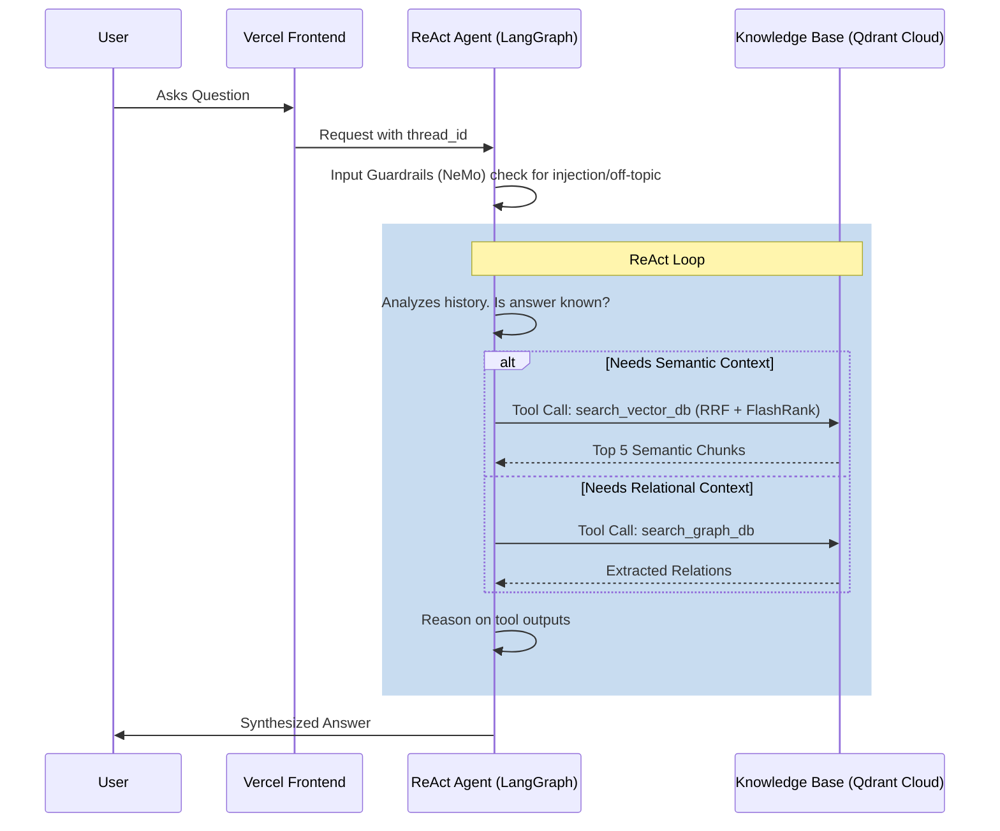

# 🤖 Portfolio Web Bot: System Architecture

A production-grade, state-of-the-art hybrid RAG personal assistant built for speed, scalability, and deep observability. This platform leverages **LangGraph** to handle complex reasoning and a highly optimized free-tier stack for document and relational intelligence.

---

## 🌟 Vision
Most RAG systems fail because they treat every query the same, leading to slow responses and context bloat. Our **Agentic RAG** distinguishes between:
1.  **Conversational Queries**: "Hi", "Who are you?", "How are you?"
2.  **Semantic Queries (Vector)**: "What is your experience with React?", "Tell me about your portfolio project."
3.  **Relational Queries (Graph)**: "What projects did you build in 2023?", "What tech stack connects your web projects?"

By using a **Tool-Calling ReAct Agent** architecture, we ensure that deep technical answers are grounded in the precise retrieval method needed. The Agent intrinsically understands short-term memory, perfectly handles follow-up questions without re-searching the database, and iteratively calls semantic or relational tools only when fresh context is required.

---

## 🏗️ High-Level Flow (ReAct Agent)

---

## 📂 Project Organization
*   **`app/`**: The core Python package containing the LangGraph Agent, Retrieval Pipelines, Services, Guardrails, and Portkey Gateway.
*   **`data/`**: The local ground-truth documentation used for ingestion (git-ignored).
*   **`docs/`**: This documentation suite, capturing the architecture and tracking progress.
*   **`scripts/`**: Developer CLI scripts for ingesting sources, testing guardrails, and testing gateways.

---

## 🚀 Quick Navigation
1.  **Ingestion Engine**: [02_INGESTION_ENGINE.md](02_INGESTION_ENGINE.md)
2.  **Node Intelligence**: [03_NODE_INTELLIGENCE.md](03_NODE_INTELLIGENCE.md)
3.  **FlashRank Reranking**: [07_FLASHRANK_RERANKING.md](07_FLASHRANK_RERANKING.md)
4.  **Guardrails**: [08_GUARDRAILS.md](08_GUARDRAILS.md)
5.  **LLM Gateway**: [09_LLM_GATEWAY.md](09_LLM_GATEWAY.md)
6.  **Threat Model**: [threat-model.md](threat-model.md)
7.  **Implementation Plan & Log**: [PLAN.md](PLAN.md)
8.  **Agent Context**: [../CLAUDE.md](../CLAUDE.md)
