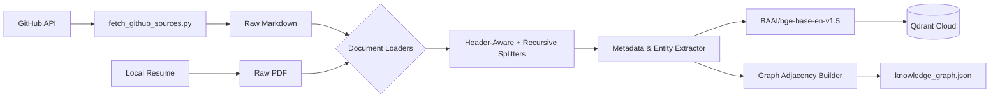

# 📥 Ingestion Engine: Data to Knowledge

The Ingestion Engine is a modular pipeline designed to fetch, parse, and structure raw markdown and PDF data into a highly optimized vector and relational format for the portfolio bot.

## 🔄 The Pipeline Flow


---

## 🛠️ Technical Specifications

### 1. Source Acquisition & Parsing
*   **GitHub Fetcher**: An automated script (`scripts/fetch_github_sources.py`) pulls `README.md` and `docs/*.md` from all of Umer's repositories (public and private) using a fine-grained PAT. It is highly optimized and idempotent via a git-blob-SHA manifest.
*   **PDFs**: The resume is loaded locally via LangChain's **PyPDFLoader**.

### 2. Intelligent Semantic Chunking
*   **Chunk Size & Overlap**: `800` characters with `300` overlap.
*   **Logic**: For markdown files, the system uses a `MarkdownHeaderTextSplitter` to preserve logical context boundaries (e.g. keeping header sections together), falling back to a `RecursiveCharacterTextSplitter`.

### 3. Entity & Metadata Extraction
During the chunking phase, the engine automatically extracts lightweight structured metadata from the text. 
*   It scans for **Platform Keywords** (e.g., GitHub, Vercel, OpenAI) and **Employer Keywords** (e.g., Saylani, SMIT).
*   This structural data (Project Name, Company, Skills, Year) is bundled directly into the Qdrant chunk payload. 
*   **Why?** Doing this once at ingestion time is far cheaper and faster than using an LLM to extract relations at query time. This metadata is what powers the Graph RAG capability.

### 4. Vectorization & Storage
*   **Embedding Model**: `BAAI/bge-base-en-v1.5` via HuggingFace. A fast, fully local, open-source embedding model that prevents us from hitting API rate limits during large batch ingestions.
*   **Vector Dimensions**: `768` dimensions. This fits perfectly within Qdrant's free-tier disk limits.
*   **Vector Database**: **Qdrant Cloud**.
*   **Distance Metric**: **Cosine Similarity**.

---

## 🌍 Universal Ingestion Command
To run the full end-to-end extraction, chunking, embedding, and vector upsert process automatically:

```bash
python -m scripts.ingest
```

---

> **Next →** [03 — Node Intelligence](03_NODE_INTELLIGENCE.md)
