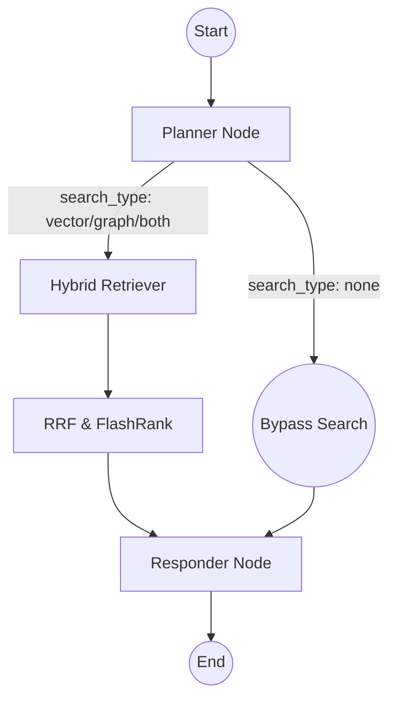

# 🧠 Node Intelligence: The Agentic Brain

The project uses a **Stateful Workflow** powered by **LangGraph**. Unlike standard RAG, our agent doesn't just blindly search the database; it *thinks* about whether a search is necessary and exactly what kind of search to perform.

---

## 🤖 The Graph Nodes

### 1. 🧭 The Planner Node
*   **Model**: Groq (Llama-3.3-70b-versatile)
*   **Logic**: The Planner is the entry point. It analyzes the entire conversation history and uses **Pydantic Structured Outputs** to classify the user's intent.
*   **Decisions**:
    *   **Conversational (`none`)**: If the user says "Hi" or asks about something already in memory, it skips the expensive search process and outputs a direct response.
    *   **Semantic (`vector`)**: For questions about Umer's skills or project descriptions.
    *   **Relational (`graph`)**: For questions about technology stack mappings or timelines.
    *   **Complex (`both`)**: When both deep context and relations are required.

### 2. 🔍 The Retriever Node
*   **Services**: Qdrant Cloud (Dense) + Local BM25 (Sparse) + GraphService + FlashRank (Reranker)
*   **Mechanics: The Hybrid Retrieval Pipeline**:
    *   **Stage 1 - Hybrid Candidate Generation**:
        *   We convert the highly optimized `search_query` into a 768-dimensional vector using local `BAAI/bge-base-en-v1.5` embeddings.
        *   We fetch top dense candidates from Qdrant and top sparse candidates from the in-memory BM25 index.
    *   **Stage 2 - Reciprocal Rank Fusion (RRF)**:
        *   The Dense and Sparse results are mathematically fused together using the RRF algorithm to balance keyword exact-matches with semantic meaning.
    *   **Stage 3 - Deep Cross-Encoder Reranking (FlashRank)**:
        *   The fused candidates are passed to **FlashRank**, running locally on the CPU.
        *   It reranks the candidates and truncates the list to the top 5 most relevant documents to prevent context window bloat.
    *   **Stage 4 - Graph Injection**:
        *   If the Planner requested `"graph"` or `"both"`, the in-memory Knowledge Graph is queried for relational data, which is prepended to the final context.

### 3. ✍️ The Responder Node
*   **Model**: Groq (Llama-3.3-70b-versatile)
*   **Logic**: This is the final synthesizer. It merges the retrieved documents, the graph context, and the conversation history to generate a natural, helpful response acting as Umer's AI representation.

---

## ⛓️ Workflow Visualization

---

## 💾 State & Memory
*   **Memory**: The graph uses `MemorySaver`. This allows the agent to maintain a "thread" of conversation to recall previous turns.
*   **State**: The `AgentState` `TypedDict` tracks:
    *   `messages`: The full chat history.
    *   `search_query`: The optimized search term generated by the Planner.
    *   `search_type`: The routing decision (`vector`, `graph`, `both`, `none`).
    *   `retrieved_docs`: The top 5 reranked semantic chunks.
    *   `graph_context`: The extracted relation strings.
