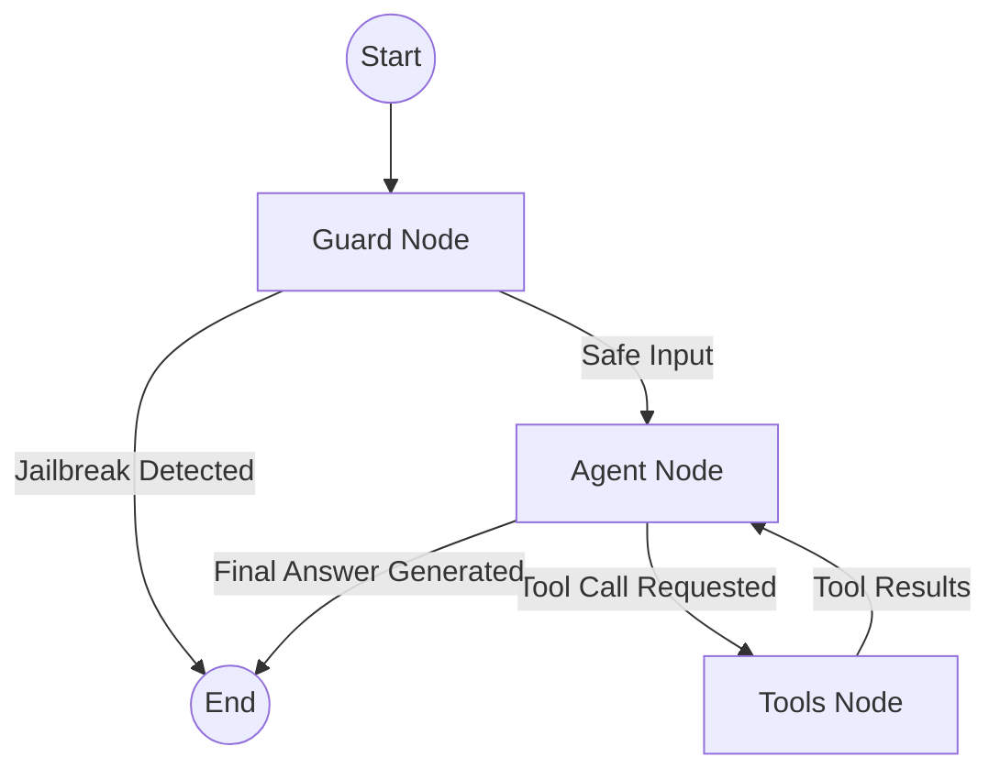

# 🧠 Node Intelligence: The Agentic Brain

The project uses a **Stateful Workflow** powered by **LangGraph**. To solve the issue of "Context Amnesia" (where the bot forgets short-term memory during follow-up questions), the architecture uses a **Tool-Calling ReAct (Reason + Act)** loop instead of a rigid forward-routing pipeline.

---

## 🤖 The Graph Nodes

### 1. 🛡️ The Guard Node
*   **Logic**: Intercepts the user's raw input before the Agent sees it using NeMo Guardrails.
*   **Decisions**: If a jailbreak or off-topic prompt is detected, it returns a hardcoded refusal, sets `rail_fired = True`, and instantly ends the graph execution to save tokens and ensure safety.

### 2. 🧠 The Agent Node
*   **Model**: `openai/gpt-oss-120b` via Portkey Gateway (Groq LPU)
*   **Logic**: The core brain. It receives the **Muhammad Umer Khan Persona** and binds the database retrieval functions to the LLM as native tools.
*   **ReAct Loop**: 
    1. It reads the chat history. 
    2. If it can answer the question from history (e.g. follow-ups), it answers instantly (0 DB calls).
    3. If it needs fresh context, it actively decides to call a database tool.
    4. If a tool fails to return useful data, it can autonomously call a *different* tool in the same turn before answering.

### 3. 🛠️ The Tools Node
This node executes the database lookups requested by the Agent. It exposes two highly optimized tools:

#### Tool A: `search_vector_db(query)`
Executes a hybrid retrieval pipeline for semantic questions (projects, skills, education):
*   **Stage 1 - Hybrid Candidate Generation**: Converts the query into a 768-dimensional vector using local `BAAI/bge-base-en-v1.5`. Fetches dense candidates from Qdrant and sparse candidates from the local BM25 index.
*   **Stage 2 - Reciprocal Rank Fusion (RRF)**: Mathematically fuses Dense and Sparse results to balance keyword exact-matches with semantic meaning.
*   **Stage 3 - Deep Cross-Encoder Reranking (FlashRank)**: The fused candidates are reranked locally on the CPU and truncated to the top 5 most relevant documents to prevent context window bloat. *(Note: Emojis are aggressively stripped prior to scoring to prevent cross-encoder score collapse).*

#### Tool B: `search_graph_db(query)`
Executes a traversal against the in-memory Knowledge Graph for relational data (e.g., mapping a specific tech stack to specific active years).

---

## ⛓️ Workflow Visualization

*The loop between Agent and Tools can occur multiple times natively if the LLM decides it needs more context from multiple sources.*

---

## 💾 State & Memory
*   **Memory**: The graph uses `MemorySaver()`, enabling the agent to maintain persistent threads across multi-turn conversations.
*   **State**: The `AgentState` is extremely lightweight:
    *   `messages`: The full chat history. Tool outputs are natively appended here as `ToolMessage` objects, ensuring the LLM never loses context of what it has already searched.
    *   `rail_fired`: Boolean flag from the Guard Node.

---

> **Next →** [04 — Tracing & Observability](04_TRACING_AND_OBSERVABILITY.md)
