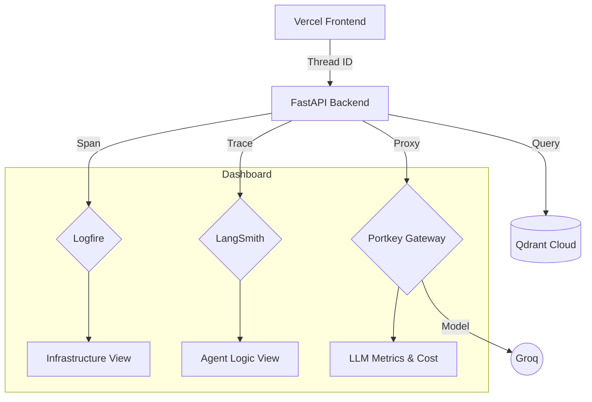

# 🕵️ Tracing & Observability

In an Agentic system, "Why did the AI say that?" is the most important question. We use a dual-tracing strategy to provide total transparency into the agent's thought process.

---

## 🔬 The Observability Stack

### 1. Pydantic Logfire (System Tracing)
Logfire provides distributed tracing for the entire infrastructure. It tracks:
*   **API Latency**: How long the FastAPI backend takes to respond.
*   **Parsing Steps**: Exactly how long chunking and embedding takes during ingestion.
*   **Database Queries**: Time taken to retrieve dense and sparse results from Qdrant and the BM25 index.

### 2. LangSmith (LLM Orchestration)
LangSmith is specialized for the "Agentic" part of the project. It records:
*   **Graph State Transitions**: How the state changed between the Planner and the Retriever.
*   **Prompt Versions**: The exact system instructions sent to Groq.
*   **Structured Output**: Tracking the exact Pydantic schema generated by the Planner.

### 3. Portkey (LLM Gateway & Metrics)
Portkey acts as the universal gateway and tracks:
*   **Token Usage**: Per-query tracking of prompt and completion tokens.
*   **Cost Estimation**: Tracks what the usage would cost even on free tiers.
*   **Model Latency**: Measures the exact time taken by the LLM (e.g., `openai/gpt-oss-120b`), stripping away our backend overhead.

---

## 📊 Tracing Architecture

---

## 🛠️ How to access
*   **Logfire**: Visit your [Logfire Project](https://logfire.pydantic.dev/).
*   **LangSmith**: Visit your [LangSmith Project](https://smith.langchain.com/).
*   **Portkey**: Visit your [Portkey Dashboard](https://app.portkey.ai/).

> [!TIP]
> All traces are linked via a common `thread_id`. If you find a bug in the UI, you can find the exact LLM call in LangSmith and the corresponding Logfire span using that ID.

---

> **Next →** [05 — Environment Variables](05_ENVIRONMENT_VARIABLES.md)
