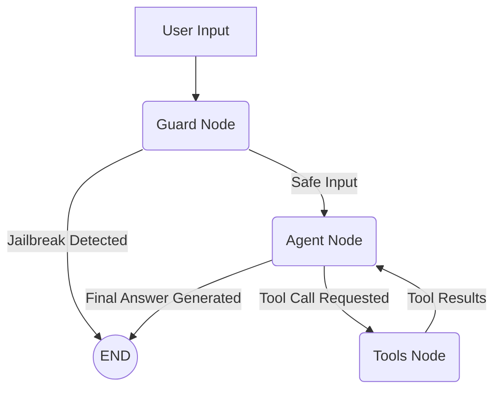

# 🧠 10. The ReAct Agent Architecture

This document outlines the core logic and structure of the **LangGraph ReAct Agent** powering the portfolio bot. 

Initially, the bot was built using a rigid "Forward-Routing Pipeline" (`Planner -> Retriever -> Responder`). However, to solve the problem of **Context Amnesia** during conversational follow-ups, the system was fundamentally restructured into a dynamic **Tool-Calling ReAct (Reason + Act)** loop.

---

## 🌟 The Paradigm Shift: Why ReAct?

In a standard RAG pipeline, the system forces a database lookup for every non-chitchat question. This creates a severe limitation:
* **The Follow-Up Bug:** If the user asks *"Tell me about SmartSearch"*, the pipeline fetches data and answers. If the user follows up with *"What technologies did you use for it?"*, the Planner guesses a new search query, fetches *new* data, and entirely overwrites the short-term memory of the previous turn.

**The ReAct Solution:**
By collapsing the pipeline into a single **Agent Node** equipped with **Tools**, the LLM intrinsically handles its own short-term memory. 
1. The Agent reads the chat history.
2. If it already knows the answer from the previous turn, it answers instantly (0 database calls).
3. If it needs fresh context, it actively decides to call a database tool.
4. If a tool fails to return useful data, the Agent can autonomously call a *different* tool in the same turn before answering the user.

---

## 🏗️ Core Nodes

The LangGraph consists of three primary custom nodes:

### 1. Guard Node (`app/agents/nodes/guard.py`)
Acts as the bouncer. It intercepts the user's raw input before the Agent sees it.
- Analyzes input using NeMo Guardrails.
- If a jailbreak or off-topic prompt is detected, it returns a hardcoded refusal and triggers `rail_fired = True`, instantly ending the graph execution.

### 2. Agent Node (`app/agents/nodes/agent.py`)
The brain of the system. 
- Injects the **Muhammad Umer Khan Persona** as a `SystemMessage`.
- Binds the database retrieval functions to the LLM as native tools (`llm.bind_tools()`).
- Evaluates the current `messages` state and either outputs a final `AIMessage` or a tool request.

### 3. Tools Node (`app/agents/nodes/tools.py`)
The execution environment for the Agent's actions. It exposes two distinct databases:
- `@tool search_vector_db(query: str)`: Executes a dense+sparse Reciprocal Rank Fusion search against Qdrant Cloud, reranked by FlashRank. Used for semantic descriptions (projects, skills, education).
- `@tool search_graph_db(query: str)`: Executes a traversal against the in-memory relational knowledge graph. Used for structured mappings (e.g., matching a tech stack to specific active years).

---

## 🔄 The ReAct Loop

The `StateGraph` routing logic in `app/agents/graph.py` orchestrates the loop natively:



*Note: The loop `Agent -> Tools -> Agent` can happen multiple times in a single turn if the LLM decides it needs more context from multiple sources.*

---

## 💾 State Management

The `AgentState` is extremely lightweight:
```python
class AgentState(TypedDict):
    messages: Annotated[Sequence[BaseMessage], add_messages]
    rail_fired: bool
```
- **No manual context tracking:** We no longer manually track `search_query` or `retrieved_docs`. 
- **Native History:** When a tool is called, LangChain natively appends a `ToolMessage` containing the database chunks directly into the `messages` list. This guarantees that the Agent never loses track of the context it has fetched across the entire conversation.
- **Checkpointer:** The `MemorySaver()` checkpointer saves the entire state to SQLite (or memory) using the session `thread_id`, enabling persistent multi-turn conversations.

---

> **Next →** [11 — Evals Theory](11_EVALS.md)
