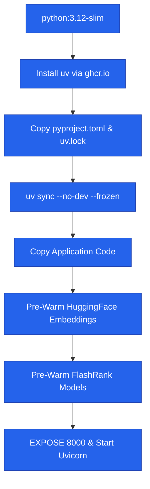
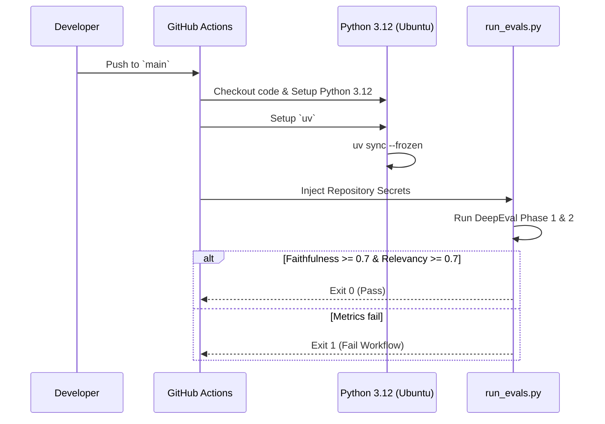

# 13 — CI/CD & Dockerization

## Why Docker and GitHub Actions?

Originally, this bot was deployed directly to Hugging Face Spaces using the Gradio SDK. However, as the architecture evolved (incorporating local BAAI embeddings, FlashRank, and complex NeMo Guardrails), the restrictive default environments of free-tier PAAS providers became a massive bottleneck.

We abandoned platform-specific deployments in favor of a universal **Docker** container and a strictly isolated **GitHub Actions CI/CD pipeline** to guarantee reproducibility, cold-start elimination, and automated testing.

---

## 🐋 The Docker Architecture

The application is containerized using a highly optimized, single-stage `Dockerfile`. 

### Key Engineering Decisions:

1. **`uv` for Dependency Resolution**: Instead of `pip` and traditional `requirements.txt`, we use `uv sync --frozen` locked against `pyproject.toml` and `uv.lock`. This guarantees 100% reproducible environments across Windows, macOS, Linux, and GitHub Actions runners in milliseconds.
2. **Model Pre-Warming (Cold-Start Mitigation)**: 
   Standard serverless containers suffer from extreme cold-start penalties when they have to download 1.5GB embedding models (like `BAAI/bge-base-en-v1.5` or FlashRank's `ms-marco`) at runtime. 
   Our Dockerfile runs a Python script *during* the `docker build` phase to download and bake the model weights directly into the Docker image layers. The container boots instantly.

### The Build Flow

---

## ⚙️ CI/CD Evaluation Pipeline

We do not currently auto-deploy to a hosting provider from GitHub Actions, because our primary goal is **Observability and Validation**. Instead, our `.github/workflows/ci.yml` runs the complete DeepEval testing suite (`scripts/run_evals.py`) automatically on every push or pull request to the `main` branch.

### The Pipeline Flow

### Secrets Management
The CI pipeline is completely stateless but requires production API keys to run the LLM-as-a-judge scoring in Phase 2. The pipeline injects the following GitHub Repository Secrets securely:

| Secret | Role in CI/CD |
|--------|---------------|
| `GROQ_API_KEY` | Primary reasoning and retrieval logic |
| `FALL_GROQ_API_KEY` | Fallback routing during 429s |
| `JUDGE_GROQ` | Dedicated DeepEval scoring (prevents exhausting primary limits) |
| `PORTKEY_API_KEY` | Tracing and telemetry |
| `PORTKEY_CONFIG` | Gateway routing configuration |
| `GROQ_SLUG` & `GROQ_SLUG_2` | Virtual keys mapped in Portkey |
| `QDRANT_API_KEY` | Fetching actual ground-truth context |
| `QDRANT_END_POINT` & `QDRANT_CLUSTER_ID` | Vector database routing |

> **Note on Optional Secrets**: `GITHUB_TOKEN` is marked as optional (`SecretStr | None`) in `app/core/config.py`. Pydantic validation will succeed in CI even if this token is not explicitly passed to the action environment.

---

## 🚀 Future Deployment
Because the app is fully Dockerized, deploying it to production requires zero code changes. You can connect this repository to AWS AppRunner, Render, or Google Cloud Run, point it to the `Dockerfile`, inject the above environment variables, and the API will be instantly globally available on port 8000.
